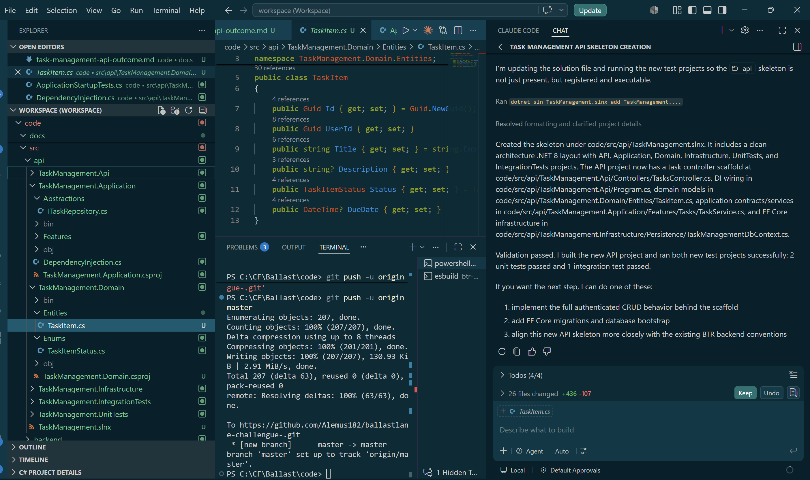

# AI Prompt Validation and Refinement Process

This document describes how the generated Task Management API output is reviewed, validated, and refined after the initial prompt execution.

## Example Outcome

The following image shows an example of the prompt outcome:

## Validation and Refinement Workflow

After the AI prompt generates the initial solution, I apply a structured review process to confirm that the output meets the expected quality and project requirements.

1. I manually review the generated files to verify that the structure, content, and implementation align with the intended architecture and functionality.
2. I execute the generated solution and use smoke testing to confirm that the main flows work as expected.
3. I follow a continuous Plan-Do-Check-Act (PDCA) cycle to identify gaps, validate improvements, and guide the next iteration.
4. I break implementation and improvement work into smaller, focused tasks so issues can be isolated and corrected more efficiently.

## Expected Result

This process improves the reliability of AI-generated output, makes validation easier, and supports steady refinement toward a usable and maintainable solution.